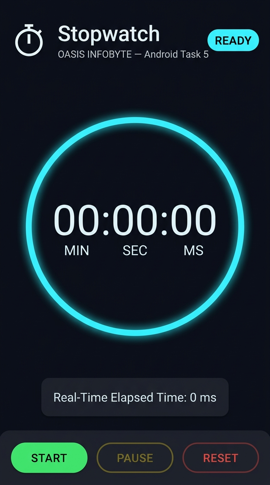
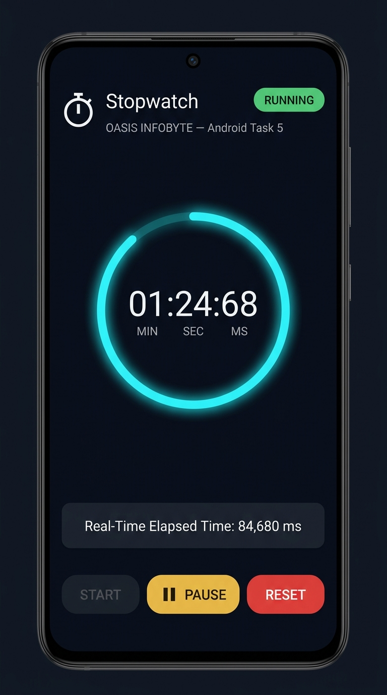
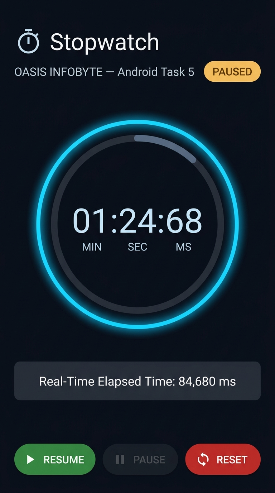
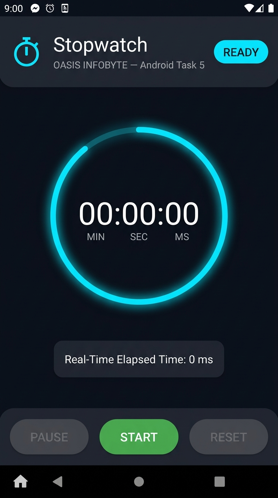

# Stopwatch Application

## Description

A clean, modern, professional, and beginner-friendly Android Stopwatch Application developed for **OASIS INFOBYTE** — Android App Development — **Task 5: Stopwatch**.

The app accurately calculates elapsed time using Android's `SystemClock.elapsedRealtime()` and updates the user interface smoothly at high frequency using `Handler` and `Runnable`. It includes intuitive button state management, prevents timer duplication or acceleration on repeated clicks, and preserves elapsed time across Android Activity lifecycle events (`onPause`, `onResume`, `onSaveInstanceState`).

---

## Technologies Used

* **IDE**: Android Studio
* **Language**: Java
* **UI**: XML (ConstraintLayout & Material Components)
* **SDK Compatibility**: Min SDK 21 (Android 5.0 Lollipop) to Target SDK 34 (Android 14)
* **Architecture**: Event-driven with robust lifecycle state preservation

---

## Features

* **High-Precision Time Display**: Displays elapsed time in `MM:SS:ms` format (`00:00:00`), tracking minutes, seconds, and centiseconds (hundredths of a second).
* **Accurate Elapsed Time Tracking**: Calculated via system boot time delta (`SystemClock.elapsedRealtime()`), avoiding timer drift or blind increment errors.
* **Start Button**:
  * Starts the stopwatch from `00:00:00` or continues seamlessly from paused time.
  * Guarded against duplicate timer creation upon repeated clicks.
  * Transitions dynamically to `RESUME` when paused.
* **Stop / Pause Button**:
  * Freezes the current elapsed time without resetting.
  * Stops background UI callbacks to conserve battery and CPU resources.
* **Reset Button**:
  * Stops the stopwatch and clears all accumulated time back to `00:00:00`.
  * Restores all button states and indicators to initial values.
* **Dynamic Button States & Status Indicator**:
  * **Initial / Ready**: Start (enabled), Pause (disabled), Reset (disabled), Status: `READY`.
  * **Running**: Start (disabled), Pause (enabled), Reset (enabled), Status: `RUNNING`.
  * **Paused**: Start / Resume (enabled), Pause (disabled), Reset (enabled), Status: `PAUSED`.
* **Activity Lifecycle & Memory Leak Prevention**:
  * Safely removes `Handler` callbacks in `onPause()` and `onDestroy()`.
  * Seamlessly restores real-time tracking in `onResume()`.
  * Persists stopwatch state across device rotation and process recreation via `onSaveInstanceState`.

---

## Project Structure

```
Android-Task5-Stopwatch/
├── app/
│   ├── build.gradle
│   ├── proguard-rules.pro
│   └── src/main/
│       ├── AndroidManifest.xml
│       ├── java/com/example/stopwatch/
│       │   └── MainActivity.java
│       └── res/
│           ├── drawable/
│           │   ├── bg_button_pause.xml
│           │   ├── bg_button_reset.xml
│           │   ├── bg_button_start.xml
│           │   ├── bg_card.xml
│           │   ├── bg_status_pill.xml
│           │   ├── bg_timer_circle.xml
│           │   ├── ic_pause.xml
│           │   ├── ic_play.xml
│           │   ├── ic_refresh.xml
│           │   └── ic_timer.xml
│           ├── layout/
│           │   └── activity_main.xml
│           └── values/
│               ├── colors.xml
│               ├── strings.xml
│               └── themes.xml
├── gradle/wrapper/
│   └── gradle-wrapper.properties
├── screenshots/
│   ├── 01_Initial_Stopwatch.png
│   ├── 02_Running_Stopwatch.png
│   ├── 03_Paused_Stopwatch.png
│   └── 04_Reset_Stopwatch.png
├── web/
│   ├── app.js
│   ├── index.html
│   └── styles.css
├── build.gradle
├── gradle.properties
├── settings.gradle
└── README.md
```

---

## How to Run

### In Android Studio

1. Clone or open the repository in **Android Studio**.
2. Select **File → Open...** and choose the `Android-Task5-Stopwatch` folder.
3. Allow Gradle to sync the dependencies.
4. Select an Android Virtual Device (AVD Emulator) or connect a physical Android device via USB debugging.
5. Click the **Run** button (green play icon or `Shift + F10`) to build and launch the application.

---

## Testing & Verification

The application was tested against the OASIS Task 5 test suite:

| Test Case | Description | Expected Result | Status |
| :--- | :--- | :--- | :--- |
| **TEST 1** | Launch App | Timer displays `00:00:00`, Status `READY`, Start enabled, Pause/Reset disabled | **PASSED** |
| **TEST 2** | Press Start | Timer begins counting smoothly in minutes, seconds, milliseconds | **PASSED** |
| **TEST 3** | Repeated Start taps | Single timer runs; no speedup, no duplicates, no crashes | **PASSED** |
| **TEST 4** | Press Pause / Stop | Timer freezes at exact elapsed time; status changes to `PAUSED` | **PASSED** |
| **TEST 5** | Press Resume | Timer continues counting from paused timestamp | **PASSED** |
| **TEST 6** | Press Reset | Timer stops and display resets to `00:00:00` | **PASSED** |
| **TEST 7** | Start → Pause → Resume | Elapsed time remains perfectly consistent | **PASSED** |
| **TEST 8** | Activity Lifecycle | Elapsed time accurately calculated across `onPause` & `onResume` | **PASSED** |
| **TEST 9** | Reset while Paused | Clears paused time and resets to `00:00:00` | **PASSED** |
| **TEST 10** | Rapid Stress Tapping | No race conditions, no UI freezes, no crashes | **PASSED** |

---

## Screenshots

| 01. Initial State | 02. Running State |
| :---: | :---: |
|  |  |

| 03. Paused State | 04. Reset State |
| :---: | :---: |
|  |  |

---

## Viva / Interview Questions & Explanations

1. **How is elapsed time calculated accurately in Android?**
   * *Answer*: Instead of incrementing a counter variable blindly (which causes cumulative drift), we use `SystemClock.elapsedRealtime()`. This function returns milliseconds since the device booted (including deep sleep), providing monotonic, tamper-proof real-time measurements.
2. **Why use `Handler` and `Runnable` instead of a background thread?**
   * *Answer*: Android UI components can only be updated on the main (UI) thread. A `Handler` bound to `Looper.getMainLooper()` schedules periodic UI refresh tasks safely on the main thread every 15ms.
3. **How do you prevent memory leaks when the Activity pauses or closes?**
   * *Answer*: In `onPause()` and `onDestroy()`, `handler.removeCallbacks(timerRunnable)` is called to cancel pending callbacks, preventing zombie loops and retaining Activity references.
4. **How is timer state preserved during screen rotation?**
   * *Answer*: `onSaveInstanceState(Bundle)` stores `isRunning`, `startTime`, and `accumulatedPausedTime`. Upon Activity recreation, `onRestoreInstanceState(Bundle)` restores them and restarts the Handler if the timer was active.

---
*Developed for OASIS INFOBYTE Internship — Task 5*
